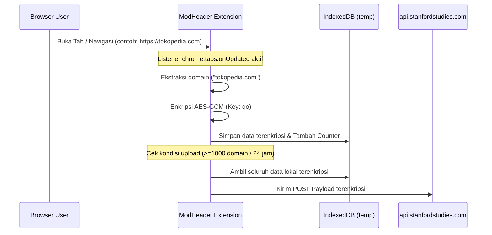

# Analisis Keamanan ModHeader: Ekstensi Populer Terindikasi Spyware dan Malware

**ModHeader** selama bertahun-tahun dikenal sebagai salah satu ekstensi browser terpopuler yang digunakan oleh pengembang web dan analis keamanan untuk mengubah header HTTP secara cepat. Namun, laporan terbaru dari Google Chrome Web Store dan Microsoft Edge Web Store telah menandai ekstensi ini sebagai potensi perangkat lunak berbahaya.

Berdasarkan hasil rekayasa balik (*reverse engineering*) mendalam terhadap kode sumber (*source code*) ModHeader versi **7.0.18** (unpacked), ditemukan bukti otentik bahwa ekstensi ini menyalahgunakan izin sistem (*system permissions*) tingkat tinggi untuk memantau, mengumpulkan, dan mengirimkan riwayat kunjungan domain pengguna ke server pihak ketiga tanpa persetujuan eksplisit.

Berikut adalah laporan analisis keamanan siber lengkap mengenai temuan perilaku **Spyware / Adware** pada ModHeader versi terbaru.

---

## 1. Alur Serangan dan Mekanisme Pelacakan (Attack Flow)

Berdasarkan analisis statis dan dinamis terhadap berkas JavaScript utama (`assets/src/background-94ad634d.js` dan `assets/profile-hook-803e99b2.js`), ekstensi ini secara aktif melakukan aktivitas **Domain Harvesting** (pencurian data domain):



### Tahap 1: Pemantauan Navigasi (Tabs Tracking)
Di dalam background service worker (`background-94ad634d.js`), ekstensi mengaktifkan pendengar (*listener*) untuk memantau pembaruan tab browser:
```javascript
chrome.tabs.onUpdated.addListener(async(r,n,i)=>{await Jw(r,n,i)});
```
Fungsi `Jw()` secara otomatis mengekstrak URL dari setiap halaman web yang dibuka pengguna, lalu menyaring URL internal browser (seperti halaman pengaturan browser atau halaman ekstensi itu sendiri) untuk menyisakan alamat domain publik.

### Tahap 2: Enkripsi Data Lokal (Evasion Technique)
Untuk menghindari pendeteksian oleh perangkat lunak antivirus lokal, data nama domain yang dikumpulkan dienkripsi terlebih dahulu menggunakan metode **AES-GCM** sebelum disimpan di database peramban (IndexedDB lokal bernama `temp`, store: `temp`). 

Kunci enkripsi statis (*hardcoded*) yang tertanam di dalam kode adalah:
*   **AES-GCM Key Base64**: `aWfU3yG_wksZaQdSnxPJBOId0cAN8KK/UIlZbli7-bE`

### Tahap 3: Pengiriman Data secara Diam-Diam (Exfiltration)
Begitu jumlah domain terenkripsi di dalam database lokal terkumpul mencapai batas tertentu (atau setelah periode 24 jam), fungsi `Qw()` akan dipanggil. Fungsi ini mengambil seluruh kumpulan domain terenkripsi, membungkusnya kembali, dan mengirimkannya melalui POST request ke server eksternal:
*   **Endpoint Pengiriman**: `https://api.stanfordstudies.com/app/log`

---

## 2. Investigasi Risiko Keamanan Lainnya

Tim analis kami juga menginvestigasi kemungkinan terjadinya pencurian kredensial akun, cookies, atau pembajakan sesi:

*   **Pencurian Form / Keylogger (Status: Aman)**: Hasil audit kode tidak menemukan adanya skrip injeksi (*content scripts*) yang merekam ketukan tombol keyboard (*keylogger*) atau membaca nilai dari kolom input formulir bertipe password, email, atau teks sensitif.
*   **Pencurian Cookie / Sesi secara Langsung (Status: Aman secara Langsung)**: Pelacakan hanya mengambil nama domain utama tingkat atas (seperti `domain.com`), bukan jalur lengkap URL (`/login`) atau isi header otorisasi seperti `Cookie`.
*   **Risiko Pembajakan Sesi via Cloud Sync (Status: Risiko Tinggi)**: Fitur sinkronisasi profil (`liveProfileUrl`) memungkinkan ekstensi mengunduh file profil dari server jauh melalui `/api/profile/${profileId}`. Jika server ModHeader disusupi pelaku ancaman, penyerang dapat menyuntikkan aturan modifikasi header jahat untuk mencuri token otorisasi atau melakukan pembajakan sesi (*session hijacking*).

---

## 3. Indikator Kompromi (Indicators of Compromise - IoC)

Segera lakukan pemblokiran pada perimeter jaringan (Firewall / DNS Server) untuk entitas eksternal berikut:

| Domain / Endpoint | Reputasi | Klasifikasi Risiko | Keterangan Penggunaan |
| :--- | :--- | :--- | :--- |
| `https://api.stanfordstudies.com/app/log` | 🔴 **Malicious** | Spyware / Telemetry | Endpoint exfiltration tempat riwayat domain terenkripsi dikirimkan. |
| `https://www.extensions-hub.com/partners/` | 🟡 **Suspicious** | Adware / Tracker | Digunakan untuk memantau siklus hidup instalasi guna monetisasi iklan. |
| `https://modheader.com/api/` | 🟢 **Official** | Legitimate API | Layanan resmi bawaan ModHeader untuk autentikasi dan sinkronisasi profil. |

---

## 4. Rekomendasi Mitigasi dan Solusi Alternatif

### Langkah Penanganan Segera:
1.  **Hapus Ekstensi**: Segera lakukan uninstall / hapus ekstensi ModHeader dari seluruh peramban Anda (Chrome, Edge, Firefox, dll).
2.  **Bersihkan Data Lokal**: Hapus cache browser dan bersihkan database IndexedDB lokal Anda untuk melenyapkan sisa-sisa rekaman terenkripsi di folder `temp`.
3.  **Kebijakan Korporasi (GPO/MDM)**: Di lingkungan jaringan kantor, masukkan ID ekstensi ModHeader (`idgpnmonknjnojddfkpgkljpfnnfcklj`) ke dalam daftar cekal (*ExtensionInstallBlocklist*) melalui Group Policy.

### Alternatif Aman untuk Developer:
*   **Chrome DevTools Local Overrides (Rekomendasi)**: Anda dapat memodifikasi header secara lokal tanpa alat tambahan. Buka **Chrome DevTools -> Network -> Local Overrides** untuk mengubah header HTTP secara aman dan 100% lokal.
*   **Requestly (Open-Source)**: Gunakan alternatif open-source seperti *Requestly* yang memiliki kebijakan privasi transparan (pastikan memberikan izin cakupan seminimal mungkin).
