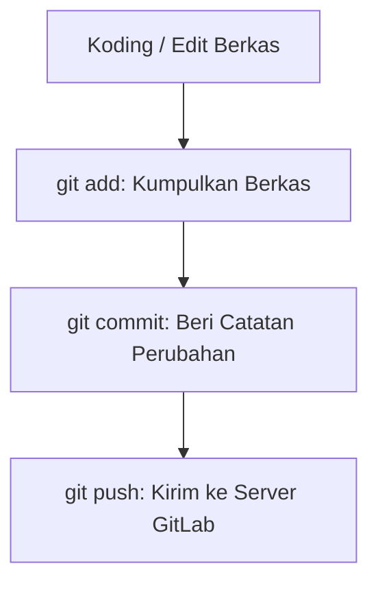

# Panduan Lengkap Menggunakan GitLab Cloud dan Self-Hosted untuk Pemula

Menggunakan Git untuk pertama kali—apalagi ketika harus terhubung ke server **GitLab Self-Hosted** (milik internal perusahaan sendiri)—sebenarnya tidak seseram yang dibayangkan. Anggap saja Git ini seperti fitur *Save As* di dalam game, namun dengan sistem yang jauh lebih cerdas karena Anda dapat kembali ke versi kode mana pun di masa lalu tanpa membuat folder proyek Anda menjadi berantakan.

Baik Anda menggunakan **GitLab Cloud** (yang di-host resmi di gitlab.com) atau **GitLab Self-Hosted** yang dikelola mandiri oleh tim IT kantor Anda, alur dasar kerja kolaborasinya tetap sama. 

Di bawah ini adalah panduan praktis dari nol sampai Anda siap melakukan *coding* dan berkolaborasi bersama tim.

---

## 1. Setup Awal Git (Sekali Saja)

Setelah menginstal Git di komputer Anda, hal pertama yang harus dilakukan adalah memperkenalkan diri Anda ke sistem agar setiap perubahan (*commit*) tercatat atas nama Anda.

Buka Terminal (Mac/Linux) atau Git Bash (Windows), lalu jalankan perintah berikut:
```bash
git config --global user.name "Nama Lengkap Anda"
git config --global user.email "emailmu@domain.com"
```

### Khusus GitLab Self-Hosted: Mengatasi Kendala Sertifikat SSL (Opsional)
Karena server GitLab dikelola secara internal oleh kantor atau organisasi Anda, terkadang tim IT menggunakan sertifikat SSL internal yang belum terverifikasi secara global. Jika Anda menemui error SSL saat mencoba melakukan kloning proyek, Anda dapat melewati verifikasi SSL untuk sementara waktu dengan menjalankan perintah:
```bash
git config --global http.sslVerify false
```

---

## 2. Alur Kerja Harian (Workflow Utama)

Ini adalah siklus kerja utama yang akan Anda lakukan setiap hari saat menulis kode. Anda cukup mengingat 4 langkah utama ini:



### Langkah A: Ambil Proyek dari GitLab (Clone)
Cari dan klik tombol **Clone** di halaman repositori GitLab proyek Anda. Salin URL-nya (pilih opsi HTTPS untuk kemudahan otentikasi awal), lalu jalankan perintah berikut di terminal:
```bash
git clone https://gitlab.internal-kamu.com/username/nama-projek.git
cd nama-projek
```

### Langkah B: Buat Jalur Kerja Baru (Branch)
Sangat tidak disarankan untuk menulis kode langsung di jalur utama (`main` atau `master`). Selalu buat jalur (*branch*) baru untuk menampung fitur yang sedang Anda kerjakan agar tidak merusak kode produksi tim.
```bash
git checkout -b fitur-baru-saya
```

### Langkah C: Simpan Perubahan (Add & Commit)
Setelah Anda selesai mengubah atau menambah berkas di editor teks Anda, periksa statusnya terlebih dahulu:
```bash
git status
```
Jika berkas-berkas yang diubah sudah sesuai, kumpulkan dan simpan riwayatnya:
```bash
# 1. Kumpulkan semua berkas yang berubah
git add .

# 2. Simpan dengan pesan komitmen yang jelas
git commit -m "fitur: menambahkan modul verifikasi data"
```

### Langkah D: Kirim ke Server GitLab (Push)
Sekarang, kirimkan hasil pekerjaan Anda dari repositori lokal komputer ke server GitLab:
```bash
git push origin fitur-baru-saya
```

---

## 3. Proses Menggabungkan Kode (Merge Request)

Setelah Anda melakukan `git push`, kode Anda sudah tersimpan dengan aman di server GitLab, tetapi belum menyatu dengan kode utama proyek tim. Untuk menyatukannya, Anda perlu membuat **Merge Request (MR)** melalui antarmuka web browser:

1.  **Buka GitLab di Browser**: Masuk ke repositori proyek GitLab Anda.
2.  **Buat Merge Request (MR)**: Biasanya, GitLab akan menampilkan spanduk (*banner*) kuning di bagian atas bertuliskan *"Create Merge Request"* sesaat setelah Anda melakukan push branch baru. Klik tombol tersebut.
3.  **Isi Detail Perubahan**: Pilih target branch (biasanya ke branch `main` atau `development`). Tuliskan judul dan deskripsi singkat mengenai fitur apa saja yang Anda tambahkan atau ubah.
4.  **Tunjuk Reviewer & Assignee**: Tunjuk rekan kerja satu tim atau *Senior Developer* sebagai **Reviewer** untuk memeriksa kualitas kode Anda. Jika sudah siap, klik **Submit Merge Request**.

---

## 4. Tips Tambahan untuk GitLab Self-Hosted

### Gunakan Personal Access Token (PAT)
Pada GitLab versi terbaru, sistem sering kali menolak login menggunakan password akun biasa saat melakukan kloning atau push demi keamanan. Jika Anda mengalami error autentikasi, Anda harus menggunakan Token:
1.  Buka GitLab via browser -> klik foto profil Anda -> **Settings** -> **Access Tokens**.
2.  Buat token baru dengan mencentang hak akses `read_repository` dan `write_repository`.
3.  Salin token yang dihasilkan dan gunakan token tersebut sebagai **kata sandi (password)** saat terminal meminta autentikasi Git.

### Selalu Sinkronkan Kode Lokal Anda
Sebelum mulai menulis kode baru di pagi hari, biasakan menarik pembaruan terakhir yang dideploy oleh tim Anda agar kode Anda tetap sinkron dan memperkecil risiko bentrok:
```bash
git checkout main
git pull origin main
```

---

## 5. Cara Mengatasi "Merge Conflict"

Mengalami **Merge Conflict** adalah bagian dari proses pendewasaan seorang pengembang. Hal ini terjadi ketika Anda dan rekan tim Anda mengubah baris kode yang sama di dalam berkas yang sama secara bersamaan, sehingga Git bingung menentukan kode milik siapa yang harus dipertahankan.

Jangan panik dan jangan menghapus folder proyek Anda! Selesaikan masalah ini secara terstruktur dengan langkah-langkah berikut.

### Contoh Skenario Konflik
Saat Anda berada di branch fitur Anda (`fitur-kamu`) dan mencoba menggabungkan kode terbaru dari branch `main` agar sinkron, muncul pesan peringatan konflik:
```plaintext
CONFLICT (content): Merge conflict in src/controllers/auth.js
Automatic merge failed; fix conflicts and then commit the result.
```

### 4 Langkah Penyelesaian Konflik:

#### Langkah 1: Temukan Berkas yang Bentrok
Jalankan perintah berikut untuk melihat daftar berkas yang mengalami konflik (ditandai dengan warna merah dan status *both modified*):
```bash
git status
```

#### Langkah 2: Buka Berkas dan Periksa Tanda Konflik
Buka berkas yang bermasalah tersebut menggunakan editor teks (seperti VS Code). Anda akan melihat tanda pembatas konflik otomatis yang disisipkan oleh Git:

```javascript
<<<<<<< HEAD
// Ini kode buatan KAMU yang ada di branch saat ini
const userUrl = "https://gitlab.internal-kamu.com/api/v1";
=======
// Ini kode buatan REKAN TIMMU yang diambil dari main
const userUrl = "https://isekai-tech.internal/api/v2";
>>>>>>> main
```
*   Bagian antara `<<<<<<< HEAD` dan `=======` adalah kode yang Anda tulis di komputer lokal Anda.
*   Bagian antara `=======` dan `>>>>>>> main` adalah kode yang ditulis oleh orang lain yang sudah terkirim ke server terlebih dahulu.

#### Langkah 3: Pilih dan Bersihkan Kode
Diskusikan dengan rekan tim Anda untuk menentukan kode mana yang benar dan akan digunakan. Hapus semua tanda pembatas (`<<<<<<<`, `=======`, `>>>>>>>`) dan sisakan kode yang valid dan bersih. 

*Hasil akhir yang bersih:*
```javascript
// Keputusannya: Menggunakan URL versi terbaru dari tim
const userUrl = "https://isekai-tech.internal/api/v2";
```
*(Tips: Jika Anda menggunakan VS Code, di atas kode tersebut akan muncul pilihan praktis seperti "Accept Current Change" untuk mengambil kode Anda, atau "Accept Incoming Change" untuk mengambil kode rekan tim).*

#### Langkah 4: Simpan dan Laporkan Hasil Perbaikan
Setelah berkas dirapikan dan disimpan di editor, jalankan perintah di bawah ini untuk memberi tahu Git bahwa konflik telah selesai diatasi:
```bash
# 1. Tandai berkas yang telah diperbaiki
git add src/controllers/auth.js

# 2. Lakukan commit untuk menyelesaikan proses merge
git commit -m "fix: menyelesaikan merge conflict pada auth controller"

# 3. Dorong kembali ke GitLab internal
git push origin fitur-kamu
```

### Kiat Pro Menghindari Konflik
*   **Rajin Melakukan Pull**: Jangan menyimpan kode di komputer lokal terlalu lama tanpa disinkronkan. Semakin sering Anda melakukan `git pull`, semakin kecil skala konflik yang mungkin terjadi.
*   **Komunikasi Aktif**: Koordinasikan dengan tim Anda jika Anda akan mengubah berkas konfigurasi utama atau routing yang sering diakses bersama agar tidak melakukan modifikasi pada saat yang bersamaan.
